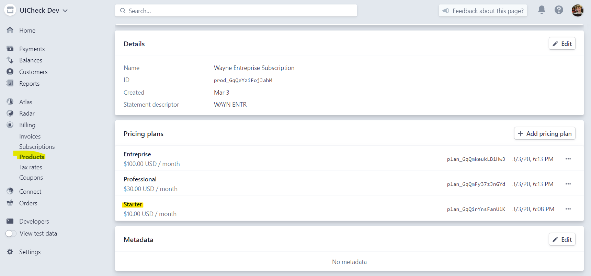

# What is UiCheck 🤷‍♂️

UiCheck is a drop-in subscription management portal for your users.

Visit at [https://uicheck.io/](https://uicheck.io/).

## 🤷‍♂️ Why would I use UiCheck?

**To save time!** Maybe you are creating the newest and wildest SaaS, filming some top of the line video tutorials or starting any kind of subscription based business. 

In a business with subscription revenue, you need a page where your users can manage their billing information, upgrade plan, see their past invoices and update their credit cards. 

Programming a billing management page looks straightforward at first

> Programming my billing page should take an afternoon. Just need to create a Stripe account and integrate their API with my website!
>
> _Billy - developing cool SaaS 🐱‍🏍_

However, the reality is very different. Stripe has a subscription product called Stripe Billing, but you have to get familiar with a lot of their APIs concept before getting productive. Once you get productive, their APIs get updated and you have to keep up with the changes. Finally, you must translate everything in term of UI and buttons, since Stripe does not provide any kind of hosted subscription management portal.

This is where UiCheck comes in to save the day. You embed the following snippet of code on your website:

```markup
<div id="uicheck-embed"></div>
<script>
    window.uicheckSettings = {
            uicheckId: 'uicheck_id',
            customerId: 'stripe_customer_id',
            signature: 'signature',
    }
</script>
<script src="https://cdn.uicheck.io/uicheck.js" async></script>
```

And... you get a personalized subscription management portal for each of your customers 🚀:



You can now focus on other part of your website. To goal of UiCheck is to save you precious time so you can instead develop the business logic that will bring the value to your subscription business. 

But to see if it works for you there is no better way that trying it out. Follow the installation guide to see how it's easy and fast to integrate UiCheck into your website. 


Need more help?[ Chat with us on Facebook!](https://m.me/UiCheck) We will be happy to see how we can help you and improve our doc. 


