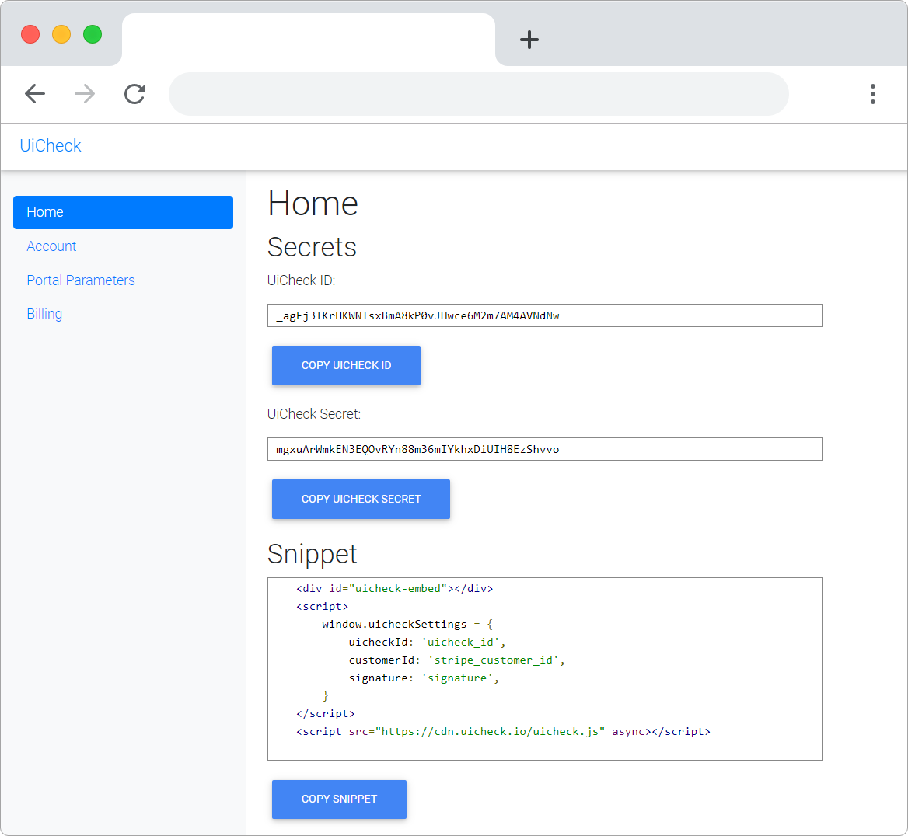
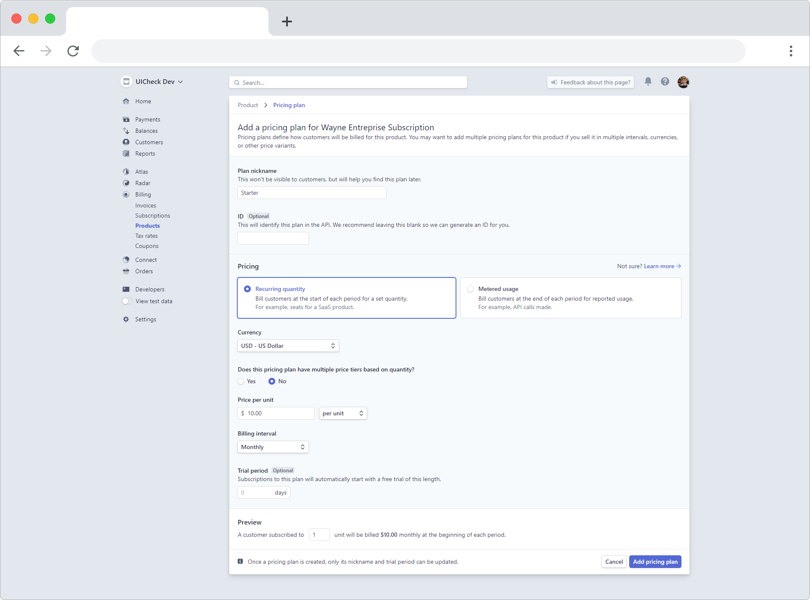
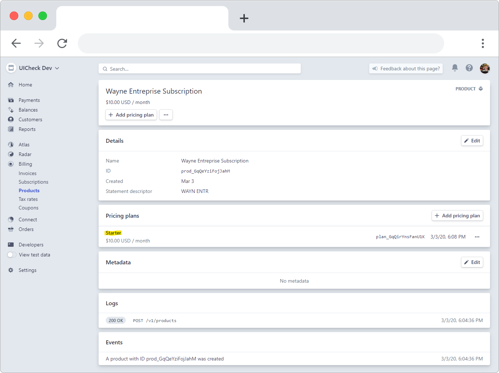

# Add plans 💲

Any subscription business needs multiple tiers a customer can subscribe to. Here is how to add plans in Stripe so that they get suggested to you customer in UiCheck.

Go to your Stripe dashboard \([https://dashboard.stripe.com/](https://dashboard.stripe.com/)\) then go to the Billing section then to the product section \([https://dashboard.stripe.com/subscriptions/products](https://dashboard.stripe.com/subscriptions/products)\)

Now create **one** product representing what you what to sell. We will split this product in multiple tiers afterwards.


Advanced topic : Note that there exist multiple ways of setting up Stripe billing subscriptions and plans. We present the recommended way of setting up plans so they are fully compatible with UiCheck. 


Note that the name you are entering at this point does not really matter, because this is not what UiCheck will be displaying to your customer.

You will then be redirected to the page where you can add a plan to your product. 

NOW the name you are entering is important. UiCheck will display this name to your customer. A good choice of plan names could be : Starter, Professional or Entreprise.

So go ahead and create a plan:

You can now see on the product's page that there is one plan linked to it.

Now press the add pricing plan button to add more subscribing options to your customer. 

For the purpose of this tutorial we are going to create 3 plans in total. Starter at 10$/month, Professional at 30$/month and Entreprise at 100$/month. Don't worry you can easily delete later the plans and the product we created for this tutorial.


Need more help?[ Chat with us on Facebook!](https://m.me/UiCheck) We will be happy to see how we can help you and improve our doc. If something is not clear we would love to hear about it 😍


