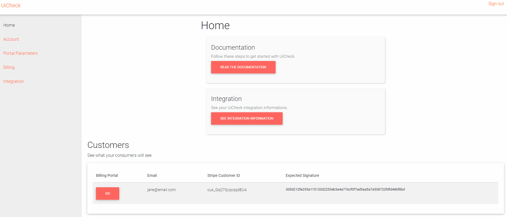
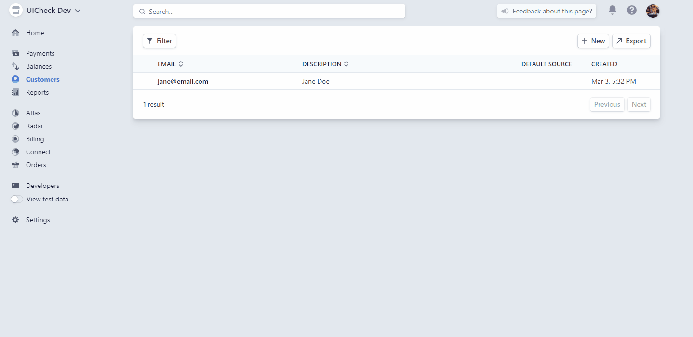
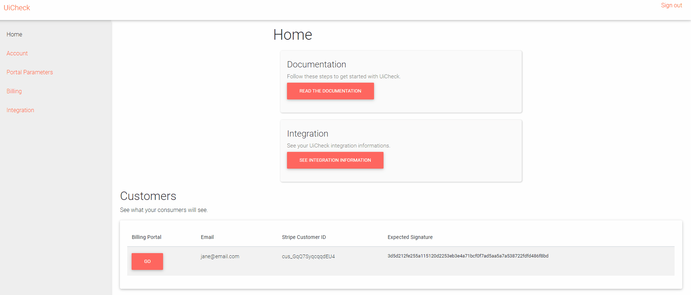

# Subscribe a customer to a plan 🚴‍♂️

So you have customers and Billing plans in your Stripe live account. You are able to preview what your customers will see through the preview page. Let's subscribe a customer.

Go to UiCheck home page [https://app.uicheck.io/](https://app.uicheck.io/), Go to the preview section, and Click Go on a customer that is not subscribed to any plan. 


To add a description to your plans, [follow these steps](../extra/add-description-to-plans.md).


You now see the 3 plans we created in the previous steps. Go ahead and click on subscribe on any of these 3 plans.

You are presented with a subscription interface. This is what you customer will see when he will click on one of these button. 

**Warning**: Do not enter a credit card. If you enter a credit card here, you will be charged, since we are using Stripe in livemode.

Since we would like to try out UiCheck interface without putting a real credit card here is what we can do: Go to the customers interface in Stripe dashboard \([https://dashboard.stripe.com/customers](https://dashboard.stripe.com/customers)\). 

Now, click on the customer you want to simulate a subscription with, then add subscription to this customer. Select one of the plan created earlier, then press Start Subscription without changing the default parameters.

Now, if you go back to the UiCheck preview interface, you should be able to see that this customer is now subscribed to the plan you selected.

You will see that the invoices are "Due" instead of paid. This is normal, since we bypassed the credit card subscription. Also there is no registered credit card. 

If you want to see real example, you can connect your credit card to the customer and debit your credit card for real. The money will go back into your Stripe account minus the fees. Here what the interface looks like when you use a real credit card. 

You are now ready to programmatically integrate UiCheck to your website.

