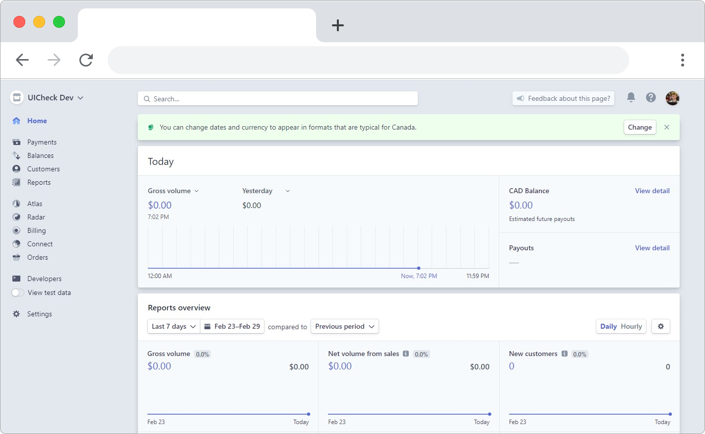
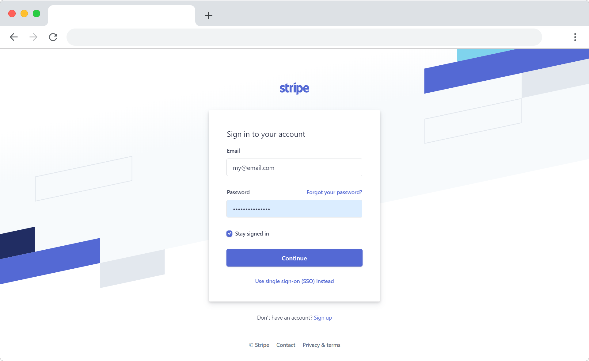

# Add customers


If you already have some Stripe live customers you can skip this page.


At the moment UiCheck works only with Stripe in livemode. This means that you need to add some live customers in your Stripe account to test the integration with UiCheck. 

First go to your Stripe dashboard and login with the account you connected to UiCheck. If your Stripe account is not connected to UiCheck, [check out our tutorial.](../create-an-account/connect-your-stripe-account.md)

Go to the Customers page

Create a new customer

You now have a Stripe Customer:


Need more help?[ Chat with us on Facebook!](https://m.me/UiCheck) We will be happy to see how we can help you and improve our doc. If something is not clear we would love to hear about it 😍


