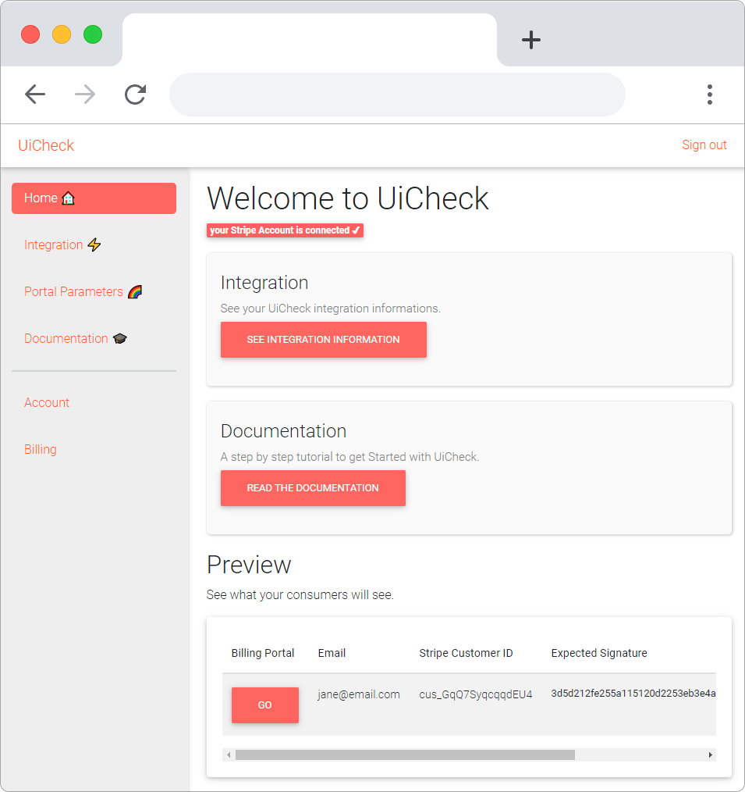

# Add customers 🙋‍♀️


If you already have some Stripe live customers you can skip this page.


To see how UiCheck works you will need Stripe customers in your Stripe Account. Go to your Stripe Dashboard and add some test customers. \([https://dashboard.stripe.com/customers](https://dashboard.stripe.com/customers)\).

Go to the Customers page \([https://dashboard.stripe.com/customers](https://dashboard.stripe.com/customers)\)

Create a new customer

You now have a Stripe Customer:

Now if you Go back in the UiCheck interface you should see this customer appear.

If you click in the See button you will be able to see what you customer will see when his billing page will be loaded.

As you can see there is a notice that no plans are available. We are going to fix that in the next step.




Need more help?[ Chat with us on Facebook!](https://m.me/UiCheck) We will be happy to see how we can help you and improve our doc. If something is not clear we would love to hear about it 😍


