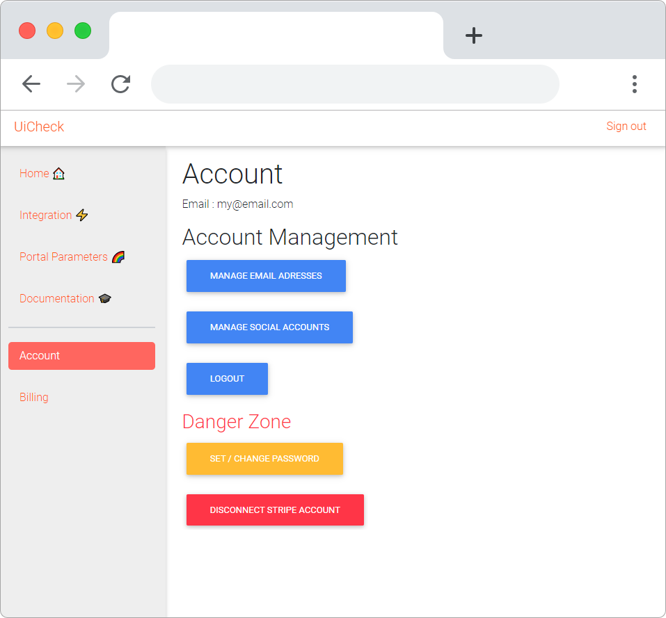

# App tour 🗽

## Onboarding

The first time you connect to UiCheck you will be asked to connect your Stripe account. 

## Home page

After completing the onboarding process you will see this page:

## Integration

All the information necessary for the integration of UiCheck to your website.

## Account Bar

## Parameters

Allow you to change parameters of the subscription portal you users will see.

## Billing

Allows you to subscribe for UiCheck.

## Conclusion

Now that you have made the tour of UiCheck you are ready to integrate it to your website. The first step is to connect you Stripe account. You can read all about it here:




Need more help?[ Chat with us on Facebook!](https://m.me/UiCheck) We will be happy to see how we can help you and improve our doc. If something is not clear we would love to hear about it 😍


