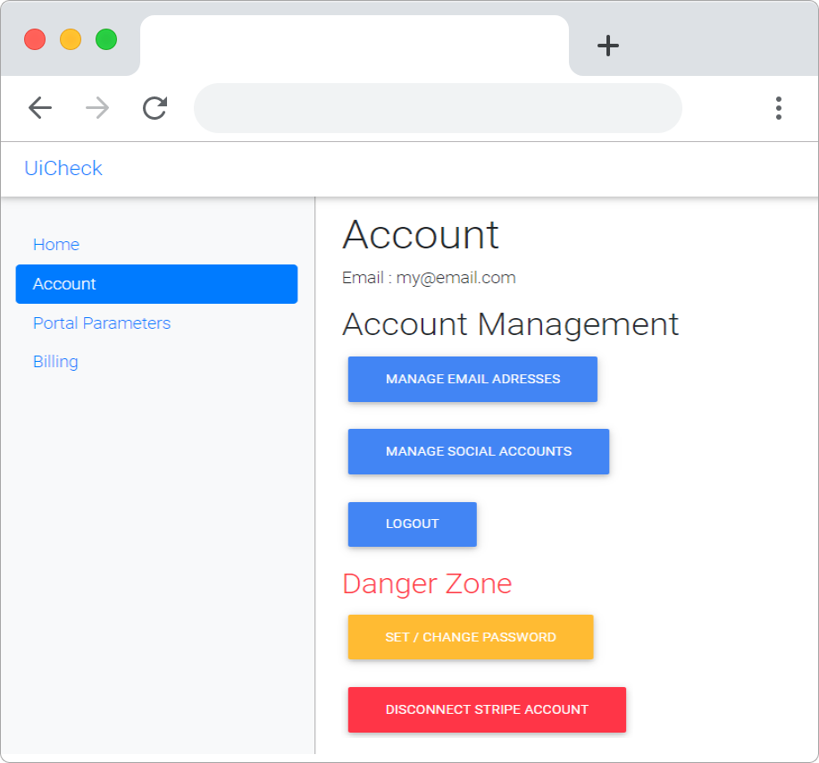

# App tour 🗽

## Home page

The first time you connect to UiCheck you will see this page.

On the home page you can connect your Stripe account. This will be very important in the following steps. If you want to skip ahead see how to connect your Stripe account [here](connect-your-stripe-account.md).

## Account page

This page allows you to manage your account. 

Account management

* **Manage email adresses**: Add, change, remove email addresses to connect to your UiCheck account
* **Manage social accounts**: Add, link, remove social account that will allow you to connect to UiCheck.
* **Logout**: Disconnect your session

Danger Zone

* **Set / Change password**: You can add a password if you connected your account with a social login. This will allow you to connect with a email / password login in addition of you connected social accounts. 
* **Disconnect Stripe account**: If you have any problem with your Stripe account you can disconnect it here and reconnect it afterwards. 

