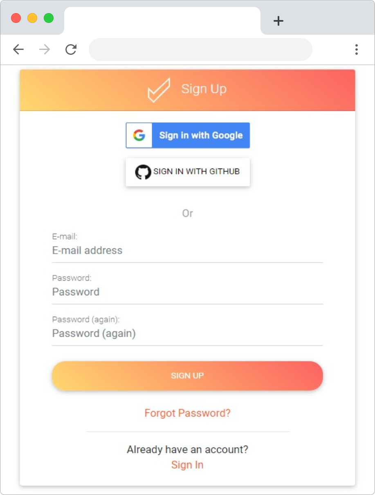

# Connect your Stripe Account 💳

In [https://app.uicheck.io/](https://app.uicheck.io/) Click **CONNECT TO STRIPE**

You will be redirected to Stripe connection portal.

Stripe might Ask you to connect to your account if it is not already done

Once connected, you will be asked to confirm which Stripe Account you want to connect

You will then be redirected back to UiCheck, but this time the interface will be different

Congratulation! 🎉You have successfully connected your Stripe account to UiCheck!

You are now ready configure your Stripe account.


Need more help?[ Chat with us on Facebook!](https://m.me/UiCheck) We will be happy to see how we can help you and improve our doc. If something is not clear we would love to hear about it 😍


