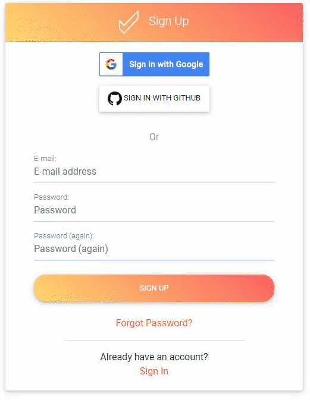

# Signing Up ✨

First, you need to go to [https://app.uicheck.io/accounts/signup/](https://app.uicheck.io/accounts/signup/)



You will be presented with the Sign Up page:

At the moment there is 3 Sign Up options:

* **Email / Password** : An old classic
* **Sign In with Google** : Will use your Google Account to Sign Up for UiCheck
* **Sign In with Github** : Will use your Github Account to Sign Up for UiCheck

### Email / Password Login

After entering your email and your password you should have access to UiCheck. A confirmation email will be sent to your email. 

### Social Login

Upon registering with a social button \(Google/Github\) you can be redirected to a page that ask you to associate an email with your account. By default, UiCheck will use the email associated with your social account.


Need more help?[ Chat with us on Facebook!](https://m.me/UiCheck) We will be happy to see how we can help you and improve our doc. If something is not clear we would love to hear about it 😍


