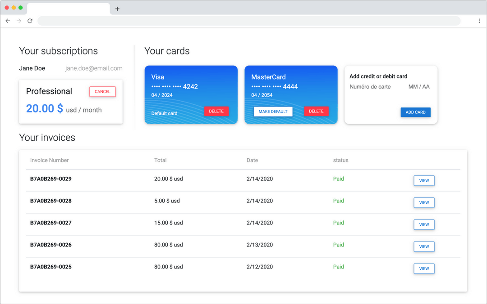

# Add description to Plans 📣

It is very simple to add a description to your plans. 

1. Find the plan you want to add a description to in your Stripe dashboard
2. Add a metadata field called "uicheck\_description"
3. Click save

#### 1. Find the plan you want to add a description to in your Stripe dashboard

2. Metadata fi

