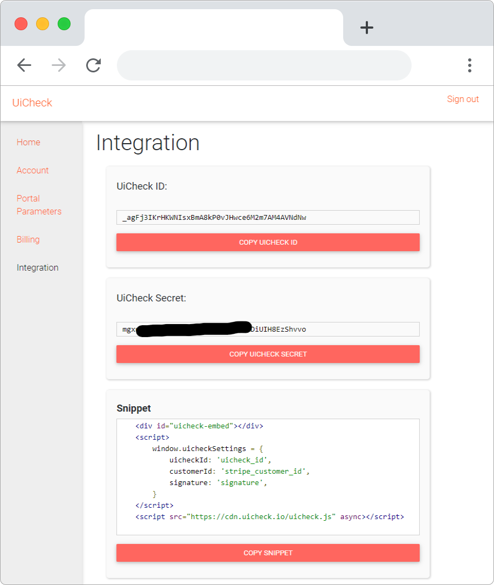

# Embedding the code 🏓

It is very easy to integrate UiCheck to your website. Just copy paste the following code and replace the following values : 

* **uicheck\_id** : your UiCheck id 
* **stripe\_customer\_id**: the stripe customer ID you want UiCheck to display
* **signature**: a signature showing that it is really you making the request to UiCheck servers.

```markup
<div id="uicheck-embed"></div>
<script>
    window.uicheckSettings = {
        uicheckId: 'uicheck_id',
        customerId: 'stripe_customer_id',
        signature: 'signature',
    }
</script>
<script src="https://cdn.uicheck.io/uicheck.js" async></script>
```

## Where to find uicheck\_id

Go to the integration page in the UiCheck dashboard \([https://app.uicheck.io/app/integration](https://app.uicheck.io/app/integration)\)




## Where to find the stripe\_customer\_id

During development, you can find Stripe customer ID in your Stripe dashboard. However, in production this value should accessible in your database and related to a user. 

### Access stripe\_customer\_id in Stripe dashboard

1. Go to the customers section of the Stripe dashboard \([https://dashboard.stripe.com/customers](https://dashboard.stripe.com/customers)\) 
2. Click on the customer you want to get the stripe\_customer\_id
3. Copy the stripe\_customer\_id \(see screenshot below\)


You can then use this value as the stripe\_customer\_id in UiCheck code snippet.

## What is the signature

The signature is a cryptographic mechanism that ensure your customers will only be able to see their billing information. It is a protection against forgery. You generate a different signature for every of your customers. The signature is created with the uicheck\_secret. To learn how to generate the signature check the following part of the tutorial:





Need more help?[ Chat with us on Facebook!](https://m.me/UiCheck) We will be happy to see how we can help you and improve our doc. If something is not clear we would love to hear about it 😍


