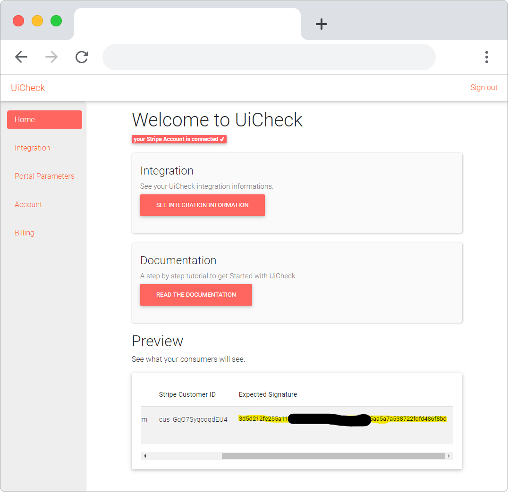

# Generating the signature ✅

This is the last part of the tutorial !!! You have made it through ! 

Here are some code snippets that shows you how to generate the signature in different languages:



```python
import hmac
import hashlib

stripe_customer_id = "cus_12345678"
uicheck_id="your_uicheck_id"
uicheck_secret="your_uicheck_secret"

signature = hmac.new(
    uicheck_secret.encode("ascii"), # keep this secret safe on your server.
    (uicheck_id + stripe_customer_id).encode("ascii"),
    digestmod=hashlib.sha256,  # hash function
).hexdigest() # pass this result to the frontend.

print(signature) # prints something like 22af9d...c00d8c 
        
```



```javascript
const crypto = require("crypto");

var stripe_customer_id = "cus_12345678"
var uicheck_id="your_uicheck_id"
var uicheck_secret="your_uicheck_secret"

const signature = crypto.createHmac(
    "sha256",
    uicheck_secret // keep this secret safe on your server.
).update(uicheck_id + stripe_customer_id).digest("hex") // pass the result to the frontend.

console.log(signature) // prints something like 22af9d...c00d8c 
```



```ruby
require 'openssl'

stripe_customer_id = "cus_12345678"
uicheck_id="your_uicheck_id"
uicheck_secret="your_uicheck_secret"

signature = OpenSSL::HMAC.hexdigest(
    'sha256', # hash function
    uicheck_secret, # keep this secret safe on your server.
    (uicheck_id + uicheck_secret) # pass this result to the frontend.
) # pass the result to the frontend.

puts(signature) # prints something like 22af9d...c00d8c 
```



## How to use the snippets 

There is an infinite way of using these snippets and there is no better way. However, if you are looking for inspiration here is a recommended approach.

You put your _uicheck\_id_ and _uicheck\_secret_ in environment variables on your backend server so they are safely stored. 

Then you can encapsulate the signature generation into a service. Here is an example in python:

```python
import hmac
import hashlib
import os

class UicheckService:
    def get_uicheck_signature(self, stripe_customer_id):
        uicheck_id = os.environ['UICHECK_ID']
        uicheck_secret = os.environ['UICHECK_SECRET']
        
        signature = hmac.new(
            uicheck_secret.encode("ascii"), # keep this secret safe on your server.
            (uicheck_id + stripe_customer_id).encode("ascii"),
            digestmod=hashlib.sha256,  # hash function
        ).hexdigest() # pass this result to the frontend.
        
        return signature   
```

And then you could use the service like this

```python
from services import UicheckService

stripe_customer_id = # here get the stripe_customer_id from your database
uicheck_signature = UicheckService().get_uicheck_signature(stripe_customer_id)
uicheck_id = os.environ['UICHECK_ID']

# return to the frontend stripe_customer_id, uicheck_signature and uicheck_id  
```

## Troubleshooting signature

UiCheck provides you with a tool to easily debug the code that generates the signature. You can see the expected signature in the preview section of the home page.




Need more help?[ Chat with us on Facebook!](https://m.me/UiCheck) We will be happy to see how we can help you and improve our doc. If something is not clear we would love to hear about it 😍


