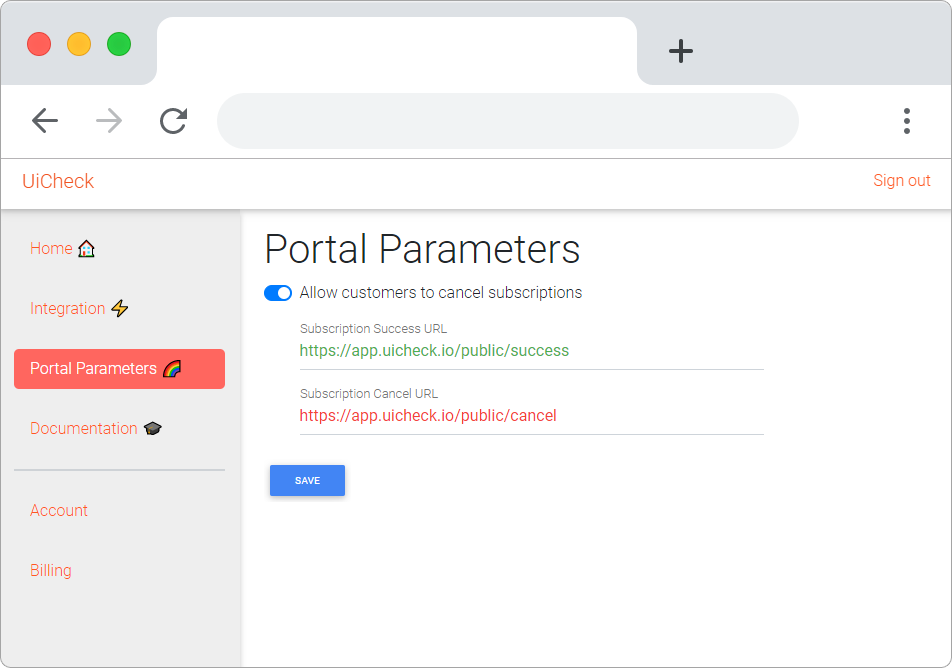

# Portal parameters 🌈

The Portal Parameters page is the page that allows you to change the parameters of the subscription portal that you display to your users. They can be accessed here: [https://dashboard.uicheck.io/parameters](https://dashboard.uicheck.io/parameters)

* **Allow customers to cancel subscriptions**: When turned off, your customers won't be able to cancel their subscriptions through the UiCheck portal
* **Subscription and Cancel URLs**: where the user is redirected where subscribing to a plan through the UiCheck Portal.

